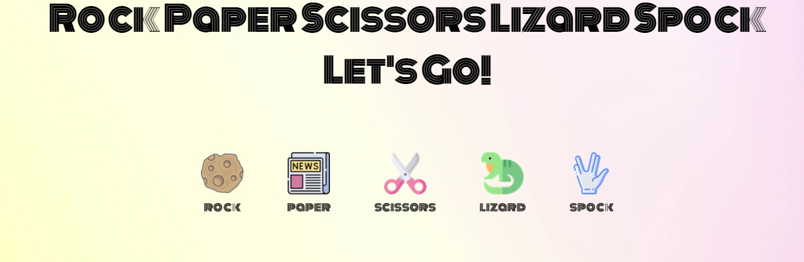
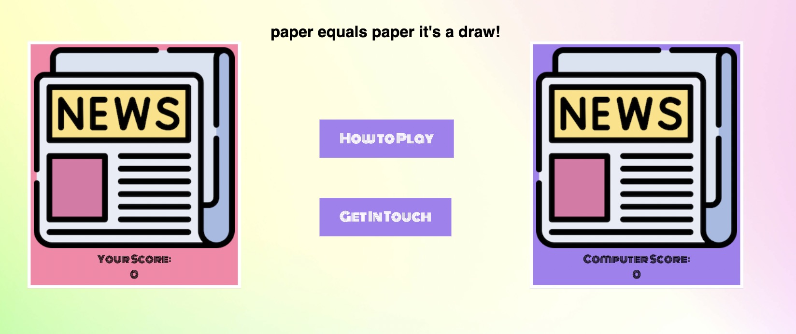
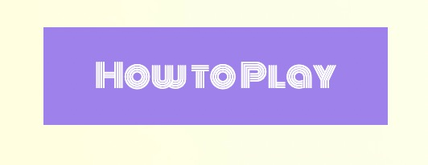
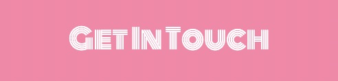
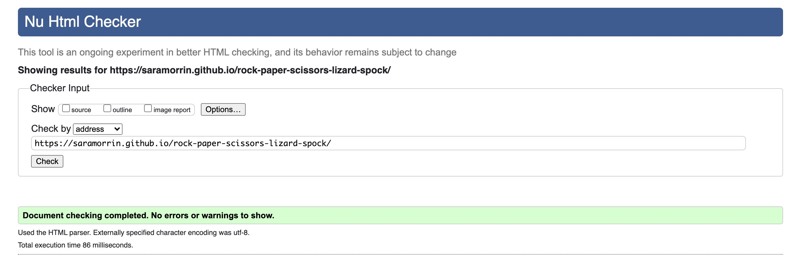
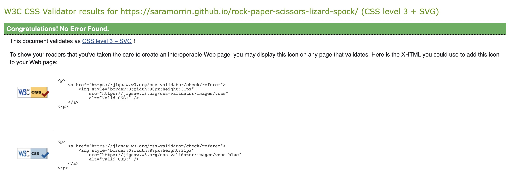
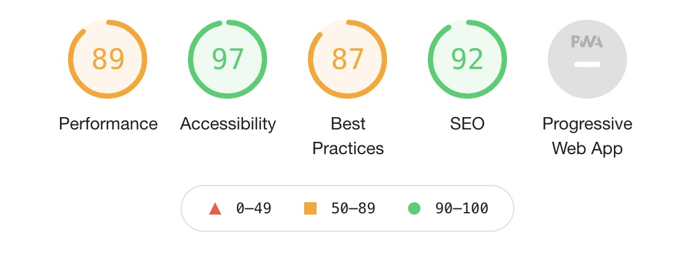

# Rock, Paper, Scissors, Lizard, Spock

Welcome to my Rock, Paper, Scissors, Lizard, Spock game.

Most people are familar with the basic Rock, Paper, Scissors game, but not everyone has heard of the Rock, Paper, Scissors, Lizard, Spock game. This version of the game orginated from the TV show, Big Bang Theory. This game adds 2 extra options, Lizard and Spock. The addition of these options changes the dynamic of the game providing the player with more variety and oportunity to win (and lose).

This project uses the programming languages of HTML5, CSS and Javascript.

A live website can be found [here](https://saramorrin.github.io/rock-paper-scissors-lizard-spock/)

# Site Design Considerations

### User Expectations
- The game should be engaging for the player and clearly display a winner and a loser
- The user interface should be easy to navigate
- There should be rules of how to play the game if the player has not played the game before
- The game should be resposive across a number of different media devices
- There should be the ability to contact the creator of the game
- There should be social media links to the game creators others games 

## Colour Scheme and Font

[My Color Space](https://mycolor.space/?hex=%23D9BDB2&sub=1) was used to choose a complimentary colour pallet based on the background image selected. The aim was to ensure the best use of contrasting colours inline with accessibility guidelines.  
The colours used were:
- ##A480F2 colour for buttons, social media icons and computer background colour result
- ##F978D4 player background result

The initial font chosen was [Monoton](https://fonts.google.com/specimen/Monoton?query=Monoton). However upon testing the font was not that clear to read across all heading sizes and paragraphs.
As a result, [Varela Round](https://fonts.google.com/specimen/Varela+Round?query=Varela+Round) was picked for the result text and modal boxes as this still provided bold look while still in keeping with the overall vision of the site. It is a clean legible font, which sits nicely of the page alongside the heading text. Sans-serif was added as a backup option for those browsers that do not support some of the modern typefaces.  

## Site Skeleton

[Balsamiq](https://balsamiq.com/) was used to create wireframes of the website. This was very useful as it gives the template of the UI. Wireframes were designed for web browser, table and a mobile browser format. 

# Features

### Game Page
- Featured at the top of the page is the title of the game. Players can quickly identify what the game is and the heading has a retro / space theme vibe in keeping with the games theme
- Below this are the player choices. All of the images are clickable to enable the player to make their choice. Again I have used the same font styling as the header and chosen images to compliment this style. The images chosen are colourful and playful and sit well against the background 

- When the player clicks a choice option the image relating to their choice is displayed in their box
- The computer choice is generated and this choice is displayed in the computer box
- The winner is declared above these display boxes and a point is awarded to the either the player score or the computer score
- The opponent to reach 5 points first is declared the winner and the game ends

### How To Play Button
- This button opens up a popup modal
- This outlines the rules of the game for players
- It also includes a video from the TV show "The Big Bang Theory" where the idea of the game first appeared

### Contact Button
- This button opens up a popup modal
- Players can leave their name and email and also submit any comments
- It enables players to provide feedback to the owners / developers regarding the game and also report any issues or errors

### Social Media Icons
- Social media icons are displayed below to main game area 
- The icons link to games social media pages which all open in a separate window. They also have a hover effect to improve the user experience

# Testing

- [EightShapes](https://contrast-grid.eightshapes.com/?version=1.1.0&background-colors=&foreground-colors=%23FFFFFF%2C%20White%0D%0A%23000000%2C%20Black%0D%0A%23D9BDB2%0D%0A%23FFE9E5%0D%0A%23B17067%0D%0A%0D%0A&es-color-form__tile-size=compact&es-color-form__show-contrast=aaa&es-color-form__show-contrast=aa&es-color-form__show-contrast=aa18&es-color-form__show-contrast=dnp) was used to check that text was compliant on both foreground and background colour combinations

# Bugs

# Validator Testing
## HTML

[W3C Markup](https://validator.w3.org/#validate_by_input) was used to check for any errors within my HTML pages. No errors were found.

 

## CSS

[W3C CSS Validator](https://validator.w3.org/#validate_by_uri) was used to check for any error within my CSS stylesheet. No errors were found.

## Accessibility

Google Dev Tools Lighthouse was used to check for any accessibility issues.

# Deployment

The site was deployed to GitHub pages.

The steps to deploy are as follows:

In the GitHub repository, navigate to the Settings tab
Select the Pages sub-menu
From the source section drop-down menu, select the Master Branch, and then hit save
Once the master branch has been selected, the page will be automatically refreshed with a detailed ribbon display to indicate the successful deployment.  

The live link can be found here - (https://saramorrin.github.io/rock-paper-scissors-lizard-spock/)

# Credits
- I used W3Schools Tutorial pages to help further my understanding of modal boxes.

# Media
 - All fonts came from [Google Fonts](https://fonts.google.com/) 
 - My background image came from [Pexels](https://www.pexels.com/)
 - All icons came from [Font Awesome](https://fontawesome.com/)
 - All images came from [Flat Icon](https://www.flaticon.com/)
 
  

